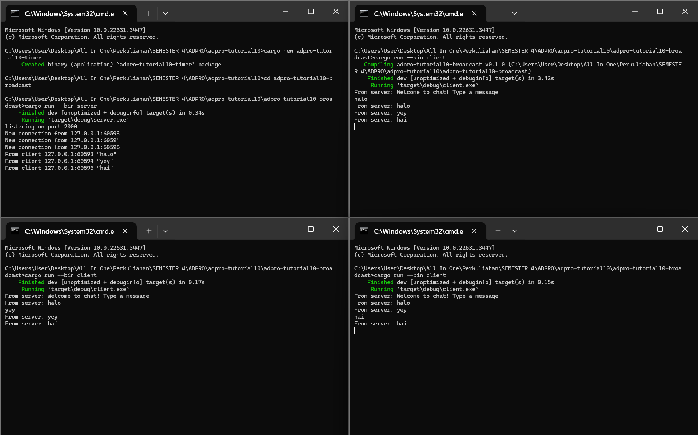

Experiment 2.1: Original code, and how it run

Run server dijalankan dengan: `cargo run --bin server`  
Run client dijalankan denga: `cargo run --bin client`

Ketika server dan client dijalankan dengan kode di atas, maka client akan terhubung ke server dan ketika ada client yang memberikan chat, maka setiap client yang terhubung ke server juga akan menerima chat dari client yang mengirim tersebut.
