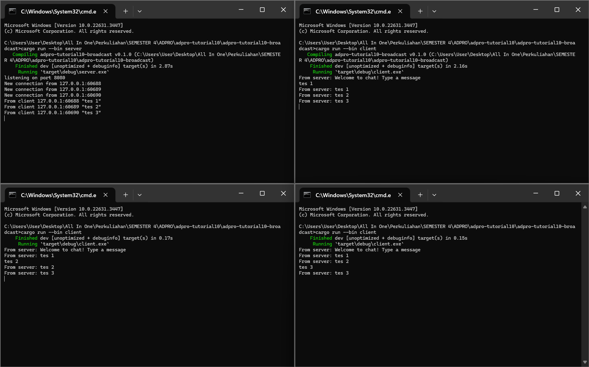

## Experiment 2.1: Original code, and how it run

Run server dijalankan dengan: `cargo run --bin server`  
Run client dijalankan denga: `cargo run --bin client`

Ketika server dan client dijalankan dengan kode di atas, maka client akan terhubung ke server dan ketika ada client yang memberikan chat, maka setiap client yang terhubung ke server juga akan menerima chat dari client yang mengirim tersebut.

## Experiment 2.2: Modifying port

port sama:

port beda:

Dapat dilihat apabila kita mengganti salah satu port antara server dan client sehingga mereka berbeda, maka client tidak dapat terkonek ke server dan menghasilkan error seperti yang ada pada gambar.

## Experiment 2.3: Small changes, add IP and Port

Dengan mengubah line `bcast_tx.send(text.into())?;` server.rs menjadi `bcast_tx.send(format!("{addr}:{text}"))?;`, maka pesan yang masuk pada server ketika client mengirimkan chat akan berubah menjadi seperti foto di ujung kiri atas.

Dan ketika mengubah line `println!("From server: {}", text);` pada client.rs menjadi `println!("ReyhanWiyasa's computer - From server: {}", text);`, maka pesan broadcast yang diterima client ketika ada client lain yang melakukan chat akan berubah menjadi seperti pada gambar.
